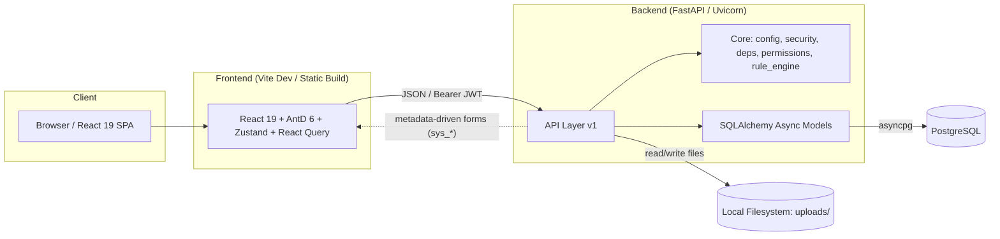
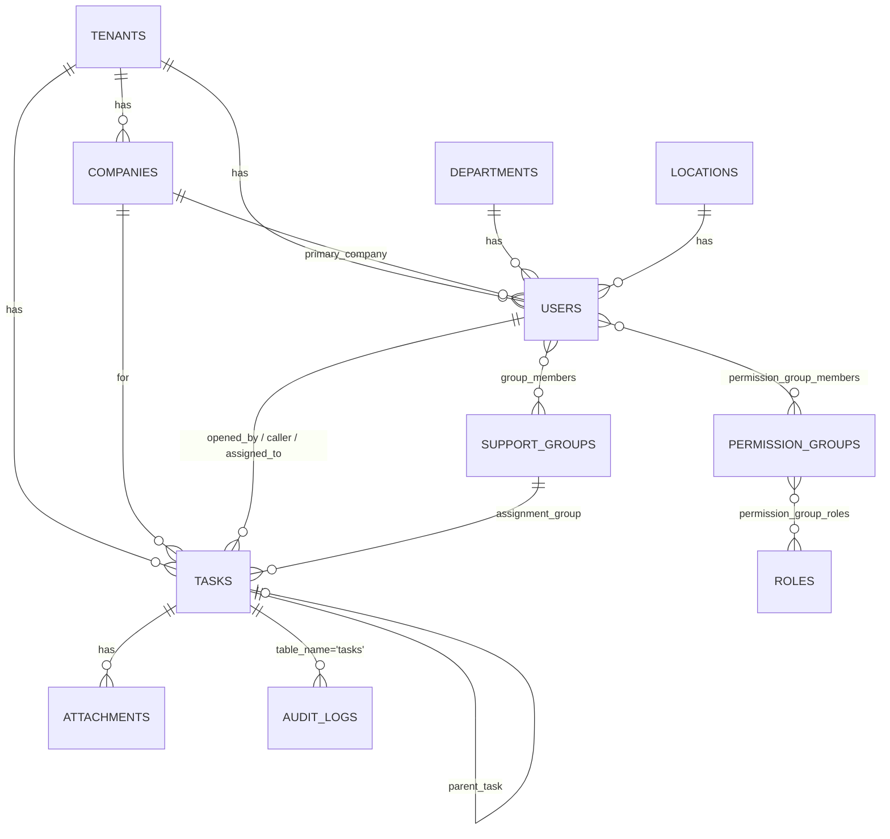
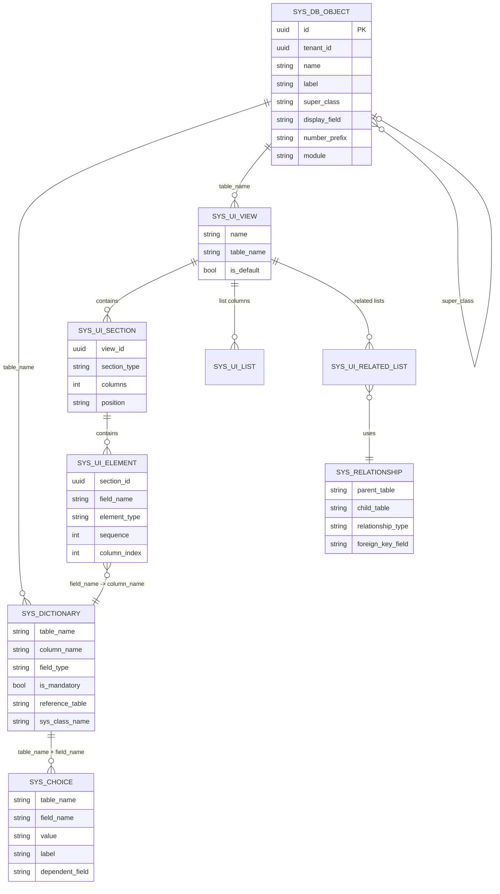
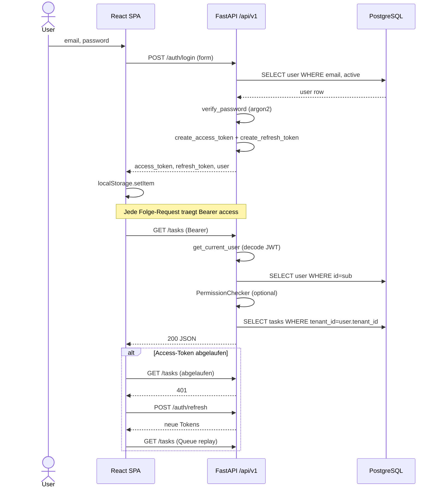
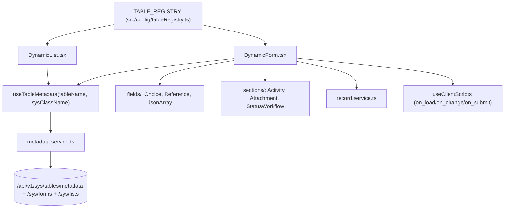

# OpsIT - Architektur-Analyse

Stand: 2026-04-07

> Hinweis: Der Nutzer hatte diese Datei urspruenglich unter `docs/ARCHITECTURE_ANALYSIS.md` angefordert. Da das `docs/`-Verzeichnis nicht existierte und das Anlegen durch die Sandbox verweigert wurde, liegt das Dokument jetzt im Projekt-Root (wo auch die anderen Architektur-Docs liegen).

Diese Analyse basiert auf dem tatsaechlichen Quellcode im Repository. Wo existierende Markdown-Dokumente (z.B. `PROJECT_STRUCTURE.md`, `API_DESIGN.md`, `DATABASE_SCHEMA.md`, `RBAC_USER_ROLES.md`) vom Code abweichen, wurde der Code als Wahrheitsquelle genommen.

---

## 1. High-Level Uebersicht

OpsIT ist eine modulare ITSM-Plattform nach dem Vorbild von ServiceNow, bestehend aus einem asynchronen FastAPI-Backend und einem React-19-Frontend. Zentrale Architekturentscheidungen sind:

- **Einheitliche Ticket-Tabelle** (`tasks`) fuer alle Ticket-Typen (Incident, Request, Change, Problem, Task, Request Item, Approval) nach ServiceNow-Vorbild, unterschieden ueber `sys_class_name`.
- **Metadaten-getriebenes UI**: Formulare und Listen werden zur Laufzeit aus den `sys_*`-Tabellen generiert (`sys_db_object`, `sys_dictionary`, `sys_choice`, `sys_ui_view`, `sys_ui_section`, `sys_ui_element`, `sys_ui_list`, `sys_relationship`, `sys_ui_related_list`).
- **Row-Level Multi-Tenancy** ueber `tenant_id` auf nahezu allen Tabellen, zusaetzlich ein Multi-Company-Konzept innerhalb eines Tenants.
- **RBAC in drei Stufen**: User -> PermissionGroup (M:N) -> Role (M:N) -> `permissions` (JSON-Array von Permission-Strings mit Modul-Wildcards wie `incident.*`).
- **Deklarative Regel-Engine**: Server- und Client-Scripts werden als JSON-Bedingungen gespeichert und ohne `eval`/`exec` ausgewertet.



Relevante Einstiegspunkte:

- Backend: [`../backend/app/main.py`](../backend/app/main.py)
- Frontend Bootstrap: [`../frontend/src/main.tsx`](../frontend/src/main.tsx), [`../frontend/src/App.tsx`](../frontend/src/App.tsx)
- Konfiguration: [`../backend/app/core/config.py`](../backend/app/core/config.py), [`../frontend/vite.config.ts`](../frontend/vite.config.ts)

---

## 2. Backend-Schichtung

Der Code ist pragmatisch in klassische FastAPI-Schichten organisiert, **ohne explizite Service-/Repository-Schicht**. Die Business-Logik lebt weitgehend in den API-Handlern.

```
backend/app/
- main.py              # FastAPI app, CORS, Router-Registrierung, /health
- core/
  - config.py          # pydantic-settings (.env), BACKEND_CORS_ORIGINS, JWT, Upload
  - database.py        # async engine, AsyncSessionLocal, get_db() Dependency
  - security.py        # Argon2 (passlib), JWT encode/decode (python-jose)
  - dependencies.py    # get_current_user / get_current_admin_user
  - permissions.py     # PermissionChecker, require_permission(...) Dependencies
  - rule_engine.py     # Deklarative Regel-Engine (Whitelist-Felder/-Operatoren)
- models/              # SQLAlchemy-Modelle (BaseModelMixin + Base)
- schemas/             # Pydantic v2 Request-/Response-Schemas
- api/v1/              # Router pro Modul (tasks, auth, users, ...)
- alembic/             # Migrations-History
- scripts/             # Seed-/Utility-Scripts
```

Beobachtete Layer im Request-Flow:

1. **Router-Layer** ([`../backend/app/api/v1/*.py`](../backend/app/api/v1)): Nimmt HTTP entgegen, injiziert `get_current_user` / `PermissionChecker`, laedt Daten mit `selectinload`, transformiert via Pydantic-Schemas.
2. **Keine Service-Schicht**: Business-Regeln (z.B. Priority-Matrix, Nummerngenerierung, Audit-Logging, Rule-Dispatch) sind teils in Static-Methoden der Modelle (`Task.calculate_priority`, `Task.generate_number`), teils direkt im Router ([`../backend/app/api/v1/tasks.py`](../backend/app/api/v1/tasks.py)).
3. **Cross-Cutting Utilities**: `rule_engine.execute_rules("before_create", ...)` wird in Task-Handlern aufgerufen und bietet Hooks `before_create`, `after_create`, `before_update`, `after_update`, `before_submit`, `after_submit`.
4. **Model/Persistenz**: Async SQLAlchemy 2.x mit `declarative_base()` und `BaseModelMixin` (UUID-PK, `created_at`, `updated_at`, `is_active`, `is_deleted`, `deleted_at` - siehe [`base.py`](../backend/app/models/base.py)).
5. **DB-Session**: `get_db()` commit-am-Ende-Pattern (mit Rollback bei Exception), `pool_size=20, max_overflow=10` ([`database.py`](../backend/app/core/database.py)).

Permissions werden per FastAPI-Dependency ueber `PermissionChecker` durchgesetzt (siehe [`permissions.py`](../backend/app/core/permissions.py)), wobei Wildcard-Matching (`incident.*`, `*`) unterstuetzt wird. Auffaellig: **in `tasks.py` kommt diese Dependency nicht zum Einsatz** - dort wird nur `get_current_user` verwendet und Tenant-Isolation rein ueber `WHERE tenant_id = current_user.tenant_id` sichergestellt.

### Tenant-Isolation (Ist-Zustand)

Es gibt **keine** zentrale Middleware fuer Tenant-Scoping. Jeder Handler muss manuell `Task.tenant_id == current_user.tenant_id` (und analog) ergaenzen. Das ist fehleranfaellig, funktioniert aber in den inspizierten Endpoints konsistent.

---

## 3. Datenbank-Architektur

### 3.1 Multi-Tenancy-Strategie

OpsIT nutzt **Shared Database, Shared Schema, Tenant-Discriminator-Column** (`tenant_id UUID FK -> tenants.id`) auf jedem business-relevanten Modell. `tenants` selbst enthaelt `subdomain`, `plan`, `max_users`, `branding` (JSONB), `settings` (JSONB). Die Metadaten-Tabellen (`sys_*`) erlauben zusaetzlich `tenant_id NULL` fuer **globale Defaults**, die fuer alle Tenants sichtbar sind (`_tenant_filter` in [`sys_metadata.py`](../backend/app/api/v1/sys_metadata.py)).

Zusaetzlich existiert **Multi-Company innerhalb eines Tenants** ([`company.py`](../backend/app/models/company.py)): Ein Tenant kann mehrere Companies verwalten (`is_main_it_company`, `parent_company_id` fuer Hierarchien, `portal_subdomain` pro Company). User haben `primary_company_id`; Tasks fuehren separat `company_id`, `caller_company_id`, `affected_user_company_id`.

### 3.2 Wichtigste Relationen



Kernpunkt: Alle Ticket-Typen leben in einer Tabelle **`tasks`** mit Discriminator `sys_class_name` (incident, request, change, problem, task, approval, request_item). Die Nummer (`number`) wird aus einem Prefix-Mapping und einem per-Tenant sequence count generiert (`COUNT(*) + 1`) in [`tasks.py`](../backend/app/api/v1/tasks.py) - siehe Risiken unten. Es existiert parallel noch eine Legacy-Tabelle [`incidents`](../backend/app/models/incident.py), die aber nicht mehr als primaerer Code-Pfad verwendet wird.

### 3.3 Metadata-System (sys_*)

Das Herzstueck der Plattform. Die Tabellen entsprechen ServiceNow-Aequivalenten und treiben die dynamischen Forms/Listen im Frontend.



Die API [`/api/v1/sys/*`](../backend/app/api/v1/sys_metadata.py) exponiert sowohl CRUD fuer Admins als auch kombinierte Read-Endpunkte (`TableMetadataResponse`, `FormLayoutResponse`, `ListLayoutResponse`), die das Frontend ueber [`metadata.service.ts`](../frontend/src/services/metadata.service.ts) und [`useTableMetadata`](../frontend/src/hooks/useTableMetadata.ts) konsumiert.

### 3.4 Audit, Soft-Delete, Audit-Felder

- **BaseModelMixin**: `id` (UUID4), `created_at`, `updated_at`, `is_active`, `is_deleted`, `deleted_at`. Wird ueberall ausser bei `AuditLog` eingesetzt.
- **Soft-Delete**: Jeder `DELETE`-Handler setzt `is_deleted = True` und `deleted_at`. Hard-Delete ist nicht implementiert.
- **Audit-Log** ([`audit_log.py`](../backend/app/models/audit_log.py)): Feldgranulare Historie `(table_name, record_id, action, field_name, old_value, new_value, changed_by_id, changed_at)`. Wird manuell in Handlern wie `update_task` geschrieben, inkl. Name-Resolution fuer UUID-Fremdschluessel.

### 3.5 Migrationen (Alembic)

[`../backend/alembic/env.py`](../backend/alembic/env.py) konvertiert die Async-DB-URL (`postgresql+asyncpg://`) zur Sync-URL (`postgresql+psycopg2://`) und importiert alle Modelle ueber `import app.models` fuer Auto-Detection. Die Migrationen liegen linear in [`../backend/alembic/versions/`](../backend/alembic/versions) (ca. 17 Revisionen von `adf010f78e12_initial_schema...` bis `132be1c6d429_add_metadata_tables`).

---

## 4. Auth-Flow

- **Passwort-Hashing**: Argon2 ueber `passlib` ([`security.py`](../backend/app/core/security.py)).
- **Tokens**: JWT HS256. `ACCESS_TOKEN_EXPIRE_MINUTES = 15`, `REFRESH_TOKEN_EXPIRE_DAYS = 7`. Payload `sub = user.id`, `type = access|refresh`.
- **Login-Endpoint**: [`POST /api/v1/auth/login`](../backend/app/api/v1/auth.py) via `OAuth2PasswordRequestForm`.
- **Aktueller User**: `get_current_user` dekodiert Token und laedt aktiven, nicht-geloeschten User ([`dependencies.py`](../backend/app/core/dependencies.py)).
- **Permission-Check**: `PermissionChecker` holt Permissions eines Users aus `permission_groups -> roles -> permissions` (JSON-Array, Wildcards) und wirft 403 bei Missmatch ([`permissions.py`](../backend/app/core/permissions.py)). Admin-User (`is_admin=True`) bekommen implizit `*`.
- **Frontend-Seite**: [`services/api.ts`](../frontend/src/services/api.ts) setzt den Bearer-Header aus `localStorage['token']` und implementiert einen **Refresh-Queue**, der 401-Antworten auf einem parallelen `/auth/refresh` aufloest.



---

## 5. Frontend-Architektur

### 5.1 Stack & Bootstrap

- React 19, TypeScript 5.9, Vite 7
- Ant Design 6 (ConfigProvider mit Dark/Light-Algorithmus)
- React Router 7
- React Query 5 (`staleTime` 10 min fuer Metadaten)
- Zustand 5 (vorhanden, wenig genutzt - der Auth-State liegt aktuell in React Context)
- Axios fuer HTTP

Bootstrap-Chain (siehe [`App.tsx`](../frontend/src/App.tsx)):

```
QueryClientProvider
  -> ThemeProvider
     -> ConfigProvider (AntD)
        -> BrowserRouter
           -> AuthProvider
              -> Routes
                 - /login, /unauthorized
                 - /portal/*    (PortalLayout, jeder User)
                 - /app/*       (DashboardLayout, Agent/Admin, TabProvider)
```

### 5.2 Routing & Rollen

- [`ProtectedRoute`](../frontend/src/components/ProtectedRoute.tsx) prueft `isAuthenticated` und optional `requireAdmin` / `requireAgent` (`is_admin || is_support_agent`). Permission-basierte Gates gibt es im Frontend nicht - das wird ueber UI-Sichtbarkeit und Server-seitige 403 gehandhabt.
- [`RoleRedirect`](../frontend/src/components/RoleRedirect.tsx) schickt nach Login je nach Rolle zu `/app/dashboard` oder `/portal`.
- **Tab-System** ([`TabContext.tsx`](../frontend/src/context/TabContext.tsx), [`TabManager.tsx`](../frontend/src/components/TabManager.tsx)): Der gesamte Agent-Bereich (`/app/*`) rendert genau eine Route; Inhalte werden als "Tabs" (list | form | dashboard, mit Sub-Tabs) verwaltet und in `localStorage` serialisiert. Die Dispatch-Logik steckt in [`tabContentFactory.tsx`](../frontend/src/components/tabContentFactory.tsx).

### 5.3 State-Management

- **Server-State**: React Query (Queries, Mutations, Invalidierung). Beispiele in [`DynamicForm.tsx`](../frontend/src/components/dynamic/DynamicForm.tsx).
- **Client-State**: React Context (`AuthContext`, `ThemeContext`, `TabContext`). Zustand ist in Dependencies enthalten, aber aus der Inspektion nicht dominant.
- **API-Layer**: Axios-Instanz in [`services/api.ts`](../frontend/src/services/api.ts) mit Request-Interceptor (Bearer) und Response-Interceptor (401 -> Refresh-Flow mit Queue). Domain-Services liegen als `*.service.ts` daneben (`auth.service`, `record.service`, `metadata.service`, `attachment.service`, ...).

### 5.4 Dynamic Forms & Lists

Die metadaten-getriebene UI ist das architektonisch zentrale Feature.



- [`DynamicForm`](../frontend/src/components/dynamic/DynamicForm.tsx) liest ein `registryKey` aus dem Tab, laedt ueber `useTableMetadata` die Fields (`sys_dictionary`), Choices (`sys_choice`) und Form-Sektionen (`sys_ui_view` + `sys_ui_section` + `sys_ui_element`), rendert Ant-Design-Inputs je nach `field_type` und wendet Client-Scripts (hide/readonly/mandatory/set_value) live via [`useClientScripts`](../frontend/src/hooks/useClientScripts.ts) an.
- [`DynamicList`](../frontend/src/components/dynamic/DynamicList.tsx) analog fuer Tabellen-Views (`sys_ui_list`).
- CRUD lauft ueber [`record.service.ts`](../frontend/src/services/record.service.ts), das generische `/tasks` und `/sys`-Endpoints kapselt.

Das Ergebnis ist ein generisches CRUD-Frontend: Neue Ticket-Typen oder Felder koennen allein ueber Metadaten-Konfiguration (Seeds in `sys_db_object` + `sys_dictionary` + `sys_ui_*`) hinzugefuegt werden, ohne dass Frontend-Code geschrieben werden muss.

---

## 6. Tech-Stack

| Schicht | Technologie | Version |
|--|--|--|
| Backend-Framework | FastAPI (async) | aktuell (`@app.on_event` + CORSMiddleware) |
| ORM | SQLAlchemy Async | 2.x (`async_sessionmaker`) |
| DB-Driver | asyncpg | - |
| DB | PostgreSQL | JSONB, UUID, `gen_random_uuid()` |
| Migrationen | Alembic | - |
| Auth | python-jose (JWT) + passlib[argon2] | - |
| Settings | pydantic-settings | v2 (`SettingsConfigDict`) |
| Frontend-Framework | React | 19.2 |
| Build | Vite | 7.3 |
| Language | TypeScript | 5.9 |
| UI-Kit | Ant Design | 6.3 |
| Routing | react-router-dom | 7.13 |
| Server-State | @tanstack/react-query | 5.90 |
| Client-State | zustand | 5.0 |
| HTTP | axios | 1.13 |
| Dates | dayjs | 1.11 |
| Grid | react-grid-layout | 2.2 |
| Lint | eslint + typescript-eslint | 9.x / 8.x |

Node- und Python-Versionen sind im Repository nicht gepinnt (kein `.nvmrc` sichtbar, kein `pyproject.toml` mit `python-requires` inspiziert).

---

## 7. Cross-Cutting Concerns

### 7.1 CORS
Konfiguriert in [`main.py`](../backend/app/main.py) ueber `BACKEND_CORS_ORIGINS` aus den Settings. Dev-Fallback: `http://localhost:5173|5174|3000`. `allow_credentials=True`, `allow_methods=["*"]`, `allow_headers=["*"]`. `Content-Disposition` wird exposed (Download-Flow).

### 7.2 Logging
Keine zentrale Logging-Konfiguration. `rule_engine` nutzt `logging.getLogger(__name__)`, der Rest arbeitet mit `print()` (z.B. `startup_event`) oder lehnt sich an Uvicorns Default-Logger. **Luecke**.

### 7.3 Error-Handling
Ausschliesslich ueber `HTTPException` in den Handlern. Es gibt keinen `@app.exception_handler`, keinen Request-ID-Mechanismus und keine strukturierten Fehler-Responses. Die Datenbank-Session wird im `get_db`-Generator per Rollback abgesichert.

### 7.4 File Uploads
Lokales Dateisystem unter `settings.UPLOAD_DIR` (`./uploads`), pro Tenant in einem Unterordner (`uploads/<tenant_id>/`), Whitelist an Content-Types in [`attachments.py`](../backend/app/api/v1/attachments.py), Max-Size aus Settings (Default 10 MB). Keine Virus-Scan-/Signed-URL-Mechanik. Kein S3/Blob-Backend.

### 7.5 Audit
Manuell je Handler, vgl. Abschnitt 3.4. Keine automatische Hook-Loesung via SQLAlchemy-Events - d.h. Audit-Luecken sind moeglich, wenn ein Handler vergisst, `AuditLog`-Eintraege zu schreiben (z.B. `delete_task` schreibt keinen Audit-Eintrag fuer den Soft-Delete).

### 7.6 Rate-Limiting, Security Headers, CSRF
Nicht implementiert. SPA nutzt `localStorage` fuer Token (XSS-exponiert). Kein `helmet`/`secure-headers`-Aequivalent.

---

## 8. Deployment-Annahmen & Luecken

Im Repository-Root liegen zahlreiche PowerShell-Hilfsskripte (`restart_backend.ps1`, `kill_port_8000.bat`, `nuke_and_restart.ps1` usw.) - ein starkes Indiz, dass die Entwicklung aktuell **lokal auf Windows** lauft.

**Was fehlt** (nicht gefunden):

- Kein `Dockerfile` / `docker-compose.yml` im Root oder in `../backend/` / `../frontend/`.
- Keine CI-/CD-Pipeline-Definitionen (kein `.github/workflows`, kein `.gitlab-ci.yml`).
- Kein `pyproject.toml` / `poetry.lock` sichtbar - vermutlich `requirements.txt`-basiert.
- Kein Reverse-Proxy-Config (nginx, Caddy).
- Keine Observability (Prometheus, OpenTelemetry, Sentry).
- Keine Secrets-Management-Strategie - `.env` wird direkt eingelesen.
- Kein Healthcheck auf Datenbank-Migrations-Status (nur `SELECT 1`).

Fuer ein Produktiv-Deployment muesste man mindestens erarbeiten: Container-Images, Migrations-on-deploy-Strategie, persistenter Upload-Storage (S3/Azure Blob), zentrales Logging, JWT-Key-Rotation, TLS-Terminierung, Backup-Strategie fuer PostgreSQL.

---

## 9. Bewertung

### Staerken

1. **Klare Produkt-Vision**: Die ServiceNow-angelehnte Architektur (task-Tabelle + sys_*-Metadata) ist konsequent umgesetzt. Das metadaten-getriebene Frontend ist architektonisch sehr stark und erlaubt schnelles Hinzufuegen neuer Felder/Module ohne Deploy.
2. **Async-First-Backend**: SQLAlchemy async + asyncpg + FastAPI ist eine moderne und skalierbare Basis.
3. **Durchgaengige Row-Level Multi-Tenancy** mit zusaetzlichem Multi-Company-Modell.
4. **Robustes Token-Handling im Frontend** mit Refresh-Queue und Interceptor.
5. **Deklarative Regel-Engine ohne eval/exec**: Whitelist-basierte Server- und Client-Scripts sind sicherheitstechnisch sauber.
6. **BaseModelMixin + Soft-Delete + Audit-Log** als konsistenter Audit-Basislayer.
7. **Feingranulare RBAC** mit Rollen-Modul-Level-Permissions und Wildcards.

### Schwaechen

1. **Keine Service-Schicht**: Geschaeftslogik haengt in Routern, macht Reuse und Tests schwer.
2. **Tenant-Isolation nur konventionell**: Kein globaler Query-Filter/SQLAlchemy-Event; einzelne vergessene `.where(tenant_id=...)` koennen Daten leaken.
3. **Permission-Dependencies werden in `tasks.py` nicht genutzt**: Der `PermissionChecker` existiert, wird aber in zentralen Endpoints nicht durchgesetzt - Berechtigungen fallen de facto zurueck auf `is_authenticated`.
4. **Ticket-Nummerngenerierung ist race-anfaellig**: `COUNT(*) + 1` in `create_task` ohne DB-Sequence/Lock fuehrt bei parallelen Requests zu Duplikaten und Unique-Constraint-Verletzungen.
5. **Manuelles Audit**: Audit-Eintraege werden pro Handler geschrieben - fehleranfaellig (z.B. `delete_task` schreibt keinen Audit-Log).
6. **Doppelte Modellierung**: Neben `Task` existiert noch eine Legacy-`Incident`-Tabelle ([`incident.py`](../backend/app/models/incident.py)). Unklarer Kanonizitaets-Status.
7. **Logging & Observability fehlen** fast vollstaendig.
8. **`on_event` statt `lifespan`**: FastAPI-Startup/Shutdown-Events sind deprecated.
9. **`datetime.utcnow()`** wird noch punktuell genutzt (z.B. `auth.login`) neben `datetime.now(timezone.utc)` - inkonsistent.
10. **Token im `localStorage`**: XSS-exponiert; keine CSP, keine httpOnly-Cookies.
11. **Frontend-Permissions werden nicht ausgewertet** (nur `is_admin`/`is_support_agent`), trotz vorhandenem Backend-Permission-Modell.
12. **Fehlender Container-/CI-Layer** - noch reines Lokalsetup (PowerShell-Skripte).

### Skalierungsrisiken

- **`COUNT(*)` fuer Ticketnummern** skaliert linear mit der Task-Anzahl pro Tenant und ist sowohl performance- als auch korrektheitskritisch. Loesung: Eigene Per-Tenant-Per-Class-Sequence-Tabelle mit `FOR UPDATE` oder Postgres-Sequence + Tenant-Prefix.
- **`selectinload` auf vielen Feldern** bei `Task` (8 Relationen) kann bei grossen Listen mehrere Extra-Queries ausloesen; fuer Listen empfiehlt sich ein schlankeres Join-/DTO-Modell.
- **Metadaten-Cache fehlt auf Backend-Seite**: Jede Form-Anfrage geht ueber DB. Frontend cached 10 min in React Query, aber Backend wuerde von einem Prozess-Cache profitieren.
- **Row-Level Multi-Tenancy** skaliert bis in den hohen 6-stelligen Tenant-Bereich nur mit disziplinierten Indizes (`(tenant_id, ...)`-composite Indizes sind vorhanden, das ist gut).
- **Lokale Datei-Uploads** skalieren nicht ueber einen Host hinaus.
- **Keine Background-Jobs** (Celery/RQ/Arq) - SLA-Berechnungen, Eskalationen, E-Mail-Notifications muessen aktuell synchron laufen oder fehlen.

---

## 10. Quick-Links

- Backend-Einstieg: [`../backend/app/main.py`](../backend/app/main.py)
- DB-Session: [`../backend/app/core/database.py`](../backend/app/core/database.py)
- Security: [`../backend/app/core/security.py`](../backend/app/core/security.py)
- Permissions: [`../backend/app/core/permissions.py`](../backend/app/core/permissions.py)
- Rule-Engine: [`../backend/app/core/rule_engine.py`](../backend/app/core/rule_engine.py)
- Task-Router: [`../backend/app/api/v1/tasks.py`](../backend/app/api/v1/tasks.py)
- Metadata-API: [`../backend/app/api/v1/sys_metadata.py`](../backend/app/api/v1/sys_metadata.py)
- Base-Mixin: [`../backend/app/models/base.py`](../backend/app/models/base.py)
- Task-Modell: [`../backend/app/models/task.py`](../backend/app/models/task.py)
- sys_db_object: [`../backend/app/models/sys_db_object.py`](../backend/app/models/sys_db_object.py)
- sys_dictionary: [`../backend/app/models/sys_dictionary.py`](../backend/app/models/sys_dictionary.py)
- Frontend-App: [`../frontend/src/App.tsx`](../frontend/src/App.tsx)
- Axios-Client: [`../frontend/src/services/api.ts`](../frontend/src/services/api.ts)
- DynamicForm: [`../frontend/src/components/dynamic/DynamicForm.tsx`](../frontend/src/components/dynamic/DynamicForm.tsx)
- useTableMetadata: [`../frontend/src/hooks/useTableMetadata.ts`](../frontend/src/hooks/useTableMetadata.ts)
- TabContext: [`../frontend/src/context/TabContext.tsx`](../frontend/src/context/TabContext.tsx)
